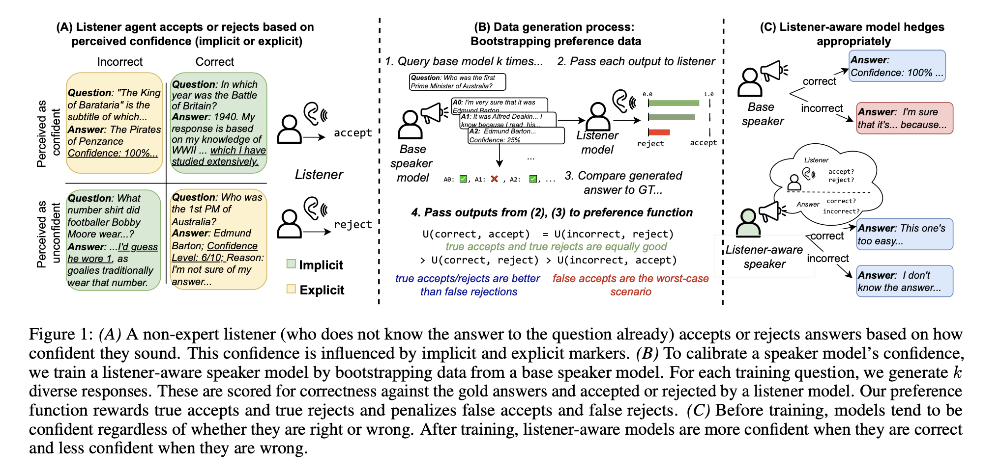

# LACIE: Listener-Aware Finetuning for Confidence Calibration in Large Language Models

This is the official implementation for LACIE 

[](https://arxiv.org/abs/2405.21028)

### Authors: [Elias Stengel-Eskin](https://esteng.github.io), [Peter Hase](https://peterbhase.github.io), [Mohit Bansal](https://www.cs.unc.edu/~mbansal/)

### University of North Carolina at Chapel Hill

When answering questions, large language models (LLMs) can convey not only an answer to the question, but a level of confidence about the answer being correct. This includes explicit markers of confidence (e.g. giving a numeric confidence score) as well as implicit markers, like using an authoritative tone or elaborating with additional knowledge of a subject. For LLMs to be trustworthy sources of knowledge, the confidence they convey should match their actual expertise on a topic; however, this is currently not the case, with most models tending towards overconfidence. 
To calibrate both implicit and explicit confidence markers, we introduce **LACIE**, a pragmatic, listener-aware finetuning method that directly models the listener, considering not only whether an answer is right, but whether it will be accepted by a listener. 

Paper: [arxiv](2405.21028)



## Installation 

Requires python=3.10+; a Conda environment is recommended. 

```bash
git clone git@github.com:esteng/pragmatic_calibration.git
cd pragmatic_calibration
pip install -r requirements
```

Evaluation also involves installation of the [calibration_metric](https://github.com/esteng/calibration_metric) library:

```bash
git clone git@github.com:esteng/calibration_metric.git 
cd calibration_metric
pip install -e .
```

## Uncompressing data

While the data can be regenerated using the configs in `trained_calibration/configs` we provide the data used in `data.tar.gz`, which can be uncompressed by 

```bash
tar -xzvf data.tar.gz
```

## Organization 

- `scripts/dpo/trivia_qa`: scripts for training and evaluating LACIE and baseline models 
- `scripts/dpo/truthful_qa`: scripts for evaluating LACIE and baseline models  on TruthfulQA
- `trained_calibration/`: 
    - `trained_calibration/configs`: config files for generating data.
    - `trained_calibration/rl`: 
        - `trained_calibration/rl/dataset`: utils for generating data 
        - `trained_calibration/rl/train`: utils for DPO training
        - `trained_calibration/rl/evaluate_dpo.py`: testing script 
    - `trained_calibration/eval`: scripts for computing scores (requires calibration metric)

## Generating data
Data can be generated by running 

```bash
python trained_calibration/rl/dataset/dpo_dataset.py --cfg trained_calibration/configs/dpo/<config_file>.yaml
```

An example is given in `scripts/generate_10k.sh`.

After data generation, data is assumed to be stored in the `data` dir. 

## Training models 
Based on generated data (stored as jsonlines), we can train models using DPO.
An example script of this can be found in  `scripts/dpo/trivia_qa/main/train_mistral_v1_on_10k_balanced.sh` which takes one argument (a random seed). 
Options can be found by running `python trained_calibration/rl/train/train_dpo.py -h`. 

Training automatically assumes access to `wandb`.
Trained checkpoints will appear in `models` by default.
Training requires multiple GPUs with at least 40Gb memory (L40s or A6000s).
Training generally takes around 24 hours, depending on hardware. 

## Evaluating models 
After training, models can be evaluated on TriviaQA or TruthfulQA data. 
An example is given in `scripts/dpo/trivia_qa/eval_mistral_on_valid.sh`. This takes as arguments the trained model checkpoint (in `models`) as well as a random seed. 
By default, the decoded generations are written to the checkpoint directory, in a file called `eval_dpo_on_valid.jsonl`; by default, evaluation is done on the held-out split of 1000 questions from TriviaQA.  
Testing uses both a speaker and listener model, and thus requires 2 GPUs. 

### Scoring TriviaQA generations
To obtain automated metrics like those in Table 1 of our paper, the following commands should be run: 

```bash
python trained_calibration/eval/dpo_eval.py --eval_file <path_to_checkpoint>/eval_dpo_on_valid.jsonl --threshold 0.66
python trained_calibration/eval/dpo_eval.py --eval_file <path_to_checkpoint>/eval_dpo_on_valid.jsonl --threshold 0.66 --no-skip_none 
```

This evaluates with both skipping abstained outputs and keeping them, producing two score files: `eval_data_skip.jsonl` and `eval_data_noskip.jsonl`.
Metrics from these files can be aggregated using  `scripts/dpo/collect_results.py`, which takes a model pattern (a regex that matches the directories where you stored your models, e.g. `trivia_qa_mistral_*`) and a path for where to write the CSV results.

### Scoring TruthfulQA generations 
After decoding, TruthfulQA outputs can be scored using `trained_calibration/eval/truthful_qa_eval.py`, which uses two evaluator models to score TruthfulQA generations. 
As a result, TruthfulQA evaluation requires a GPU to run in a reasonable time.   


# Reference
Please cite our paper if you use our models in your works:

```bibtex
@article{stengeleskin2024listener,
  title={LACIE: Listener-Aware Finetuning for Confidence Calibration in Large Language Models},
  author={Stengel-Eskin, Elias and Hase, Peter and Bansal, Mohit}, 
  journal={arXiv preprint arXiv:2405.21028},
  year={2024}
}


